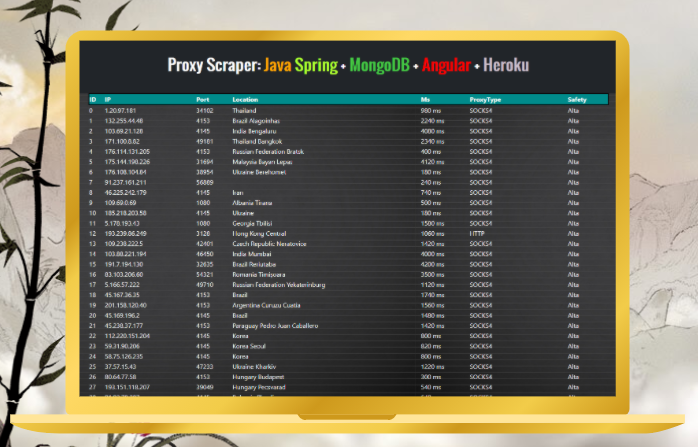

 # Proxy Scraper Spring Mongo (BackEnd)
 Proxy Scraper is a Java application developed which purpose is to scrape
 the website [HideMyName](https://hidemy.name) and use some information to store it
 through marshalling and persistence. It's also saved in a CSV every time the scraper
 starts a consultation.
 
 [Backend code](https://github.com/codepressed/proxyScraperBackend) (JAVA)
 
 [Frontend code](https://github.com/codepressed/proxyScraperFrontend) (Typescript)

## Technologies
- Angular (Frontend) with TypeScript
- Spring (Backend Framework)
- MongoDB (Database)
- JSoup (Scraping Library)

## Display

 ## Entities
 ### Proxy
 #### Table example
| ID | IP | Port | Location | MS | ProxyType | Safety |
| :---: | :---: | :---: | :---: | :---: | :---: | :---: |
| 1 | 192.168.1.0 | 4040 | Germany | 500 ms | Socks4 | High
| 2 | 192.168.1.1 | 8080 | France | 890ms | HTTP | High
- __ID:__ Primary key
- __IP:__ Proxy IP
- __Port:__ Port of the proxy
- __Location:__ Proxy location
- __MS:__ Milliseconds
- __ProxyType:__ HTTP, HTTPS (SSL), Socks4 (TCP/IP), Sock5 (UDP, DNS)
- __Safety:__ Proxy safety based on encryption

## FrontEnd Usage (npm/cli)
    npm install -g proxyscraper-frontend
    
Or if you want to install a non-global copy:

    npm install proxyscraper-frontend

 ## License and references
 [Personal Website](https://www.codebinars.com)
 
 [MIT](https://choosealicense.com/licenses/mit/)